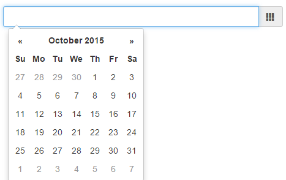

#sense-date-picker

***

***

## Nothing to show yet.

***

If you want to follow development progress and use early alpha-versions, here's some information:

* [Version 0.1.0 - First Alpha](https://github.com/stefanwalther/sense-date-picker/issues/1)
* [Version 0.2.0 - Using Fields](https://github.com/stefanwalther/sense-date-picker/issues/2)
* [Version 0.3.0 - Internationalization / i18n](https://github.com/stefanwalther/sense-date-picker/issues/3)

Overview of all milestones [here](https://github.com/stefanwalther/sense-date-picker/milestones)

## Contributing

Pull requests and stars are always welcome. For bugs and feature requests, [please create an issue](https://github.com/stefanwalther/sense-date-picker/issues).
The process for contributing is outlined below:

1. Create a fork of the project
2. Work on whatever bug or feature you wish
3. Create a pull request (PR)

I cannot guarantee that I will merge all PRs but I will evaluate them all.

## Author

**Stefan Walther**

+ [qliksite.io](http://qliksite.io)
* [twitter/waltherstefan](http://twitter.com/waltherstefan)
* [github.com/stefanwalther](http://github.com/stefanwalther)

## License

Released under the MIT license.

***

_This file was generated by [verb-cli](https://github.com/assemble/verb-cli) on October 12, 2015._